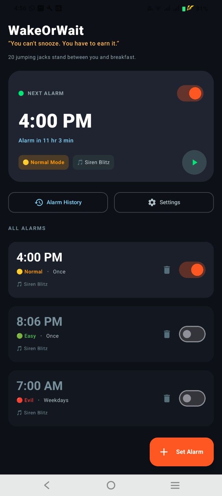
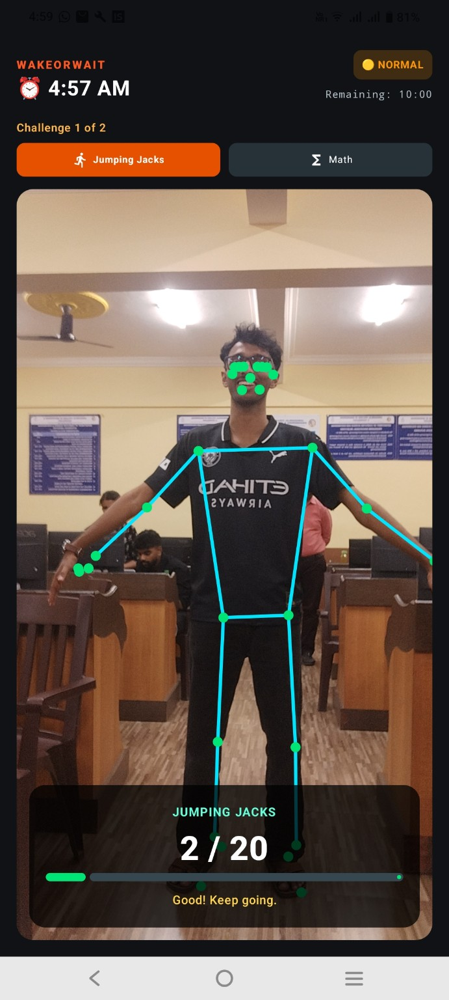
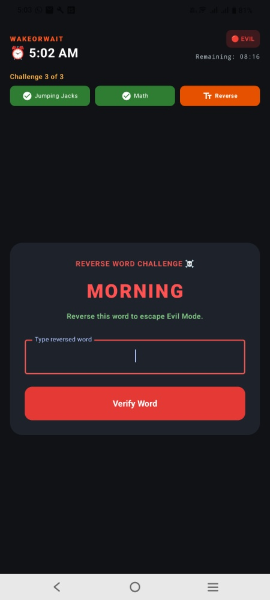
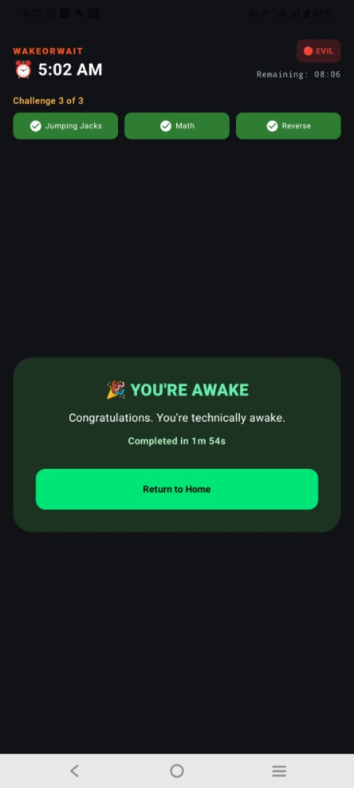
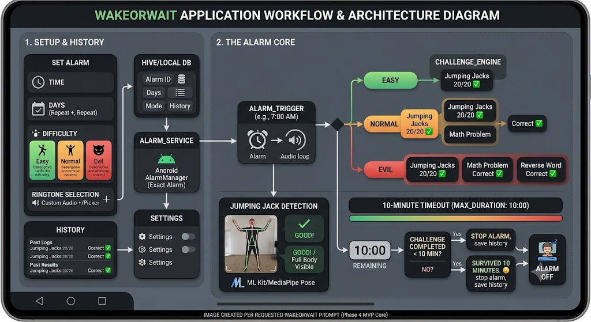

# WakeOrWait 🎯

## Basic Details
### Team Name: Avengers

### Team Members
- Team Lead: Mohammed Nihal P - jawaharlal college of engineering and technology
- Member 2: Nidal Ahammed T - jawaharlal college of engineering and technology

### Project Description
WakeOrWait is a fun challenge-based alarm that turns waking up into a small physical and mental workout. It encourages users to get out of bed, move their body, and activate their mind instead of repeatedly snoozing

### The Problem (that doesn't exist)
People have a serious problem: they are too comfortable staying in bed after the alarm rings. 😴

Normal alarms can be easily ignored or snoozed, so WakeOrWait solves this completely unnecessary problem by forcing sleepy people to exercise, solve math, and reverse words just to turn off their alarm.

### The Solution (that nobody asked for)
Instead of letting users simply press “Snooze,” WakeOrWait makes them earn their freedom. 😂

The alarm keeps ringing while the user completes jumping jacks, solves a math problem, and—if they are brave enough—reverses a word. If they give up, the alarm mercifully stops after 10 minutes.

## Technical Details
### Technologies/Components Used
For Software:
Languages used: Dart, Kotlin, XML
Frameworks used: Flutter, Android SDK
Libraries used: Camera/CameraX, Google ML Kit or MediaPipe Pose, SharedPreferences/Hive, Audio playback library
Tools used: Android Studio, VS Code, Git & GitHub, Flutter SDK, Android Emulator/Physical Android Device

### Implementation
For Software:
# Installation
flutter pub get

# Run
flutter run

### Project Documentation
For Software:
WakeOrWait is built using Flutter and Dart, with native Android functionality for reliable alarm scheduling, background execution, audio playback, camera access, and permissions. The app uses on-device pose detection to count jumping jacks and locally handles the math and word challenges. All alarm settings and history are stored locally, with no backend or internet connection required for core functionality.

# Screenshots (Add at least 3)

Home Dashboard — Manage alarms, view the next alarm, select difficulty modes, and access alarm history and settings.

Jumping Jack Challenge — The alarm uses real-time camera-based pose detection to track valid repetitions and wake the user through physical activity.

You’ve survived 20 jumping jacks, but the alarm isn't done with you yet. Now on Challenge 2 of 3, you must solve 32 × 5 − 34 to unlock the final Reverse Word stage. With 8 minutes and 49 seconds left on the clock, answer 126 to keep moving—or get used to the noise!

Jumping jacks completed, math solved, and now for the final obstacle: Challenge 3 of 3. To turn off the alarm and escape Evil Mode, you need to reverse the word MORNING (type GNINROM) before the 8-minute-and-16-second timer runs out!

You did it! All 3 Evil Mode challenges conquered in 1 minute and 54 seconds. The alarm is silenced, the 10-minute timer is stopped, and you're officially—or technically—awake. 🎉 Time to tap Return to Home and start your day!

# Diagrams

This diagram outlines the complete system workflow and technical architecture for the WakeOrWait Android application. It visualizes the two primary application domains: the user-facing configuration and the technical core that executes the alarm and challenges.Phase 1: Setup & History (User Interaction & Data Persistence)The left section of the diagram defines how a user configures an alarm and how that data is stored.1.  Set Alarm Screen (The User Input)
This is the primary user interface where the user defines the parameters for their next morning's challenge.Time & Days: The user selects the exact wake-up time and schedules the alarm to repeat on specific days of the week (e.g., Monday through Friday).Difficulty (Mode Selection): The crucial decision. The user chooses one of three progression paths, represented by visual cards:🟢 Easy (Green): Focused only on the physical activity.🟡 Normal (Yellow): A blend of physical and mental wake-up calls.🔴 Evil (Red): The most intense challenge, requiring multiple consecutive correct responses.Ringtone Selection: The user can select the default sound, pick from pre-loaded audios, or use the file picker to import custom audio (e.g., MP3/WAV). This selection is persistent.2.  Hive/Local DB (Data Persistence)
All configured alarm data (ID, scheduled days, difficulty mode, ringtone choice) is stored locally on the device. Hive (a lightweight NoSQL database for Flutter) is used, ensuring no cloud account or internet connection is required. This database also stores the Alarm History, which logs past performances (completion times vs. timeouts).Phase 2: The Alarm Core (Background Services & Real-time Processing)The large right section of the diagram illustrates the technical chain reaction that occurs when an alarm triggers. This area manages the background service, the computer vision engine, and the complex challenge logic.1.  The Android AlarmManager (Foreground Service Initiation)
Data from the local DB is passed to the Alarm_Service.Android AlarmManager: To ensure maximum reliability and function even when the app is backgrounded or the screen is locked, this native Android API is used to schedule an Exact Alarm.This manager registers a PendingIntent that, at the specified time, wakes the device and launches a robust Foreground Service. This service is critical: it maintains the alarm audio, the camera connection, and the 10-minute timeout, even if the user minimizes the UI.2.  The Alarm Trigger (ALARM_TRIGGER)
At the precise minute (e.g., 7:00 AM), the Foreground Service activates:🔊 Audio Loop: The selected custom audio or default ringtone begins playing loudly on a loop.The service also initializes the physical and mental challenge progression.3.  Real-Time Pose Estimation (JUMPING JACK DETECTION)
Immediately upon triggering, the app starts the on-device computer vision engine to detect physical activity.The Engine: ML Kit or MediaPipe Pose is activated to process the live camera feed entirely locally (preserving privacy).Detection: The engine maps a human skeleton in real-time. It requires verification that "Full Body is Visible" and the user is positioned correctly to begin.Logic: The system tracks joint angles (shoulders, elbows, hips, ankles) to count a complete repeating motion (Arms Open -> Arms Closed) as a valid jumping jack. The user sees a skeleton overlay and visual feedback, such as "GOOD! Keep going."4.  Challenge Progression (CHALLENGE_ENGINE)
This engine determines which hurdles the user must overcome, based on the selected difficulty. It progresses sequentially:🟢 Easy Path:The user must complete the 20 / 20 Jumping Jacks detection.Once confirmed (20/20 ✅), the alarm moves directly to the shutdown phase.🟡 Normal Path:The user must complete 20 / 20 Jumping Jacks ✅.Only then does a randomly generated Math Problem (e.g., $32 \times 5 - 34 = ?$) appear in the UI.The user must enter the correct answer and submit it. Once verified as Correct ✅, the alarm moves to shutdown.🔴 Evil Path (The ☠️ Mode):The user must complete 20 / 20 Jumping Jacks ✅.They must then solve the dynamic Math Problem (e.g., $32 \times 5 - 34 = 126$) and submit it ✅.Only after the math is correct does the final challenge appear: a random word is presented (e.g., MORNING), and the instruction is given to "Reverse this word" (answer: GNINROM).Once the reversed word is verified as Correct ✅, the alarm moves to shutdown.5.  The 10-Minute Timeout & Result (MAX_DURATION Management)
Crucially, the Foreground Service enforces a strict 10-minute maximum duration (600 seconds), indicated by a visual countdown timer (e.g., 08:16 Remaining).Path A (Challenge Completed < 10 MIN): The user completes all tasks according to their selected mode before the 10:00 timer expires.Path B (Timeout > 10 MIN): The 10:00 timer runs to zero. Even if challenges are incomplete, the alarm must stop to respect the user's schedule.6.  Alarm Off & Shutdown
Both paths lead to the final result:Path A Result: Display a playful victory message ("You're awake! Completed in 1m 54s. 🎉").Path B Result: Display a sarcastic survival message ("You survived 10 minutes. 🫡").The system then executes the final steps:🔇 Stop Alarm Audio (the loop ends).Save the result and completion time to the History DB.Shut down the Foreground Service to save battery.The device state is now Alarm Off.

### Project Demo
# Video
https://drive.google.com/file/d/1NThiLUl2TXzKbNZxhvu9ZJIpkGSw4FA_/view?usp=drivesdk
WakeOrWait is a challenge-based Android alarm application designed to eliminate morning oversleeping by replacing the traditional "Snooze" button with physical and cognitive wake-up tests. Built with a combination of native Android system APIs, computer vision, and state-driven challenge logic, the app forces users to physically move and engage their brains before silencing the alarm audio.Key Features & User ExperienceThree Difficulty Modes:🟢 Easy Mode: Requires 20 valid jumping jacks detected via the front-facing camera.🟡 Normal Mode: Requires 20 jumping jacks followed by 1 dynamic math problem.🔴 Evil Mode: A three-stage gauntlet requiring 20 jumping jacks, 1 advanced math problem, and 1 reverse-word challenge (e.g., reversing "MORNING" to "GNINROM").No Direct Dismiss Button: The alarm cannot be manually silenced without completing the selected challenge progression.10-Minute Maximum Safety Timeout: To prevent infinite ringing if a phone is left unattended, the alarm automatically shuts off after 600 seconds, logging a "Survived 10 minutes" result to the user's history.Custom Ringtone Engine: Allows users to import external MP3, WAV, or AAC audio files from their device via Scoped Storage APIs.100% On-Device Privacy: Camera streams and audio processing execute entirely local to the device without cloud dependencies or data transmission.Tech Stack & Core TechnologiesLayerTechnology / LibraryArchitectural RoleUI FrameworkFlutter / DartCross-platform UI management, state management, and animations.System SchedulingAndroid AlarmManagerSchedules precise, exact alarm triggers (SCHEDULE_EXACT_ALARM).Background ServiceAndroid Foreground ServiceKeeps audio looping, camera active, and timeout timers alive when screen is locked.Computer VisionGoogle ML Kit Pose DetectionReal-time, on-device human landmark tracking and jumping jack state verification.Camera AccessFlutter camera packageRaw camera stream frame extraction for real-time vision processing.Audio Engineaudioplayers / Android MediaPlayerHandles high-priority, looping alarm playback and system volume overrides.Local DatabaseHive / Shared PreferencesPersistent local storage for scheduled alarms, custom ringtones, and history logs.Application Architecture & How It Works1. Configuration & Persistence PhaseWhen a user sets an alarm, time selections, repeat schedules, difficulty modes, and audio file URIs are written to the local Hive database. The app registers an exact trigger time with Android’s native AlarmManager. To maintain persistence across system updates or device restarts, a BroadcastReceiver (BOOT_COMPLETED) automatically reschedules all active alarms upon reboot.2. Alarm Trigger & Lock-Screen ExecutionAt the designated time, AlarmManager fires a high-priority PendingIntent that spins up an Android Foreground Service configured with mediaPlayback and camera service types.Audio Lifecycle: The service launches the audio player on a continuous loop while requesting audio focus.Full-Screen Window: The app requests USE_FULL_SCREEN_INTENT to draw the full-screen challenge interface over the keyguard/lock screen, preventing the user from bypassing the alarm by locking the phone.3. Real-Time Pose Detection EngineWhen the challenge screen opens, the app initializes the device camera stream and passes raw image buffers frame-by-frame to Google ML Kit Pose Detection:Landmark Verification: The vision engine tracks 33 3D body keypoints (shoulders, elbows, wrists, hips, knees, ankles). It continuously calculates body frame alignment, showing real-time feedback like "Stand where I can see your full body."State Machine Counting: A jumping jack rep is evaluated through a strict state cycle:CLOSED State: Wrists below shoulders ($Y_{wrist} > Y_{shoulder}$) and ankles together ($\Delta X_{ankles} < 1.1 \times \text{Shoulder Width}$).OPEN State: Wrists raised above shoulders ($Y_{wrist} < Y_{shoulder}$) and ankles spread ($\Delta X_{ankles} > 1.3 \times \text{Shoulder Width}$).Increments +1 rep only when transitioning from OPEN back to CLOSED.4. Cognitive Challenges (Math & Reverse Word)Once 20 jumping jacks are registered, the Challenge Engine proceeds to the cognitive stages without requiring manual button presses:Math Engine: Dynamically generates arithmetic problems based on the difficulty mode (e.g., $32 \times 5 - 34$). The user must enter the exact numeric answer to pass.Reverse Word Engine: Selects a random string from a local dictionary (e.g., MORNING). The input parser sanitizes user entry (removing spaces and forcing uppercase) and evaluates it against the reversed array (GNINROM).5. Timeout Enforcement & Clean ShutdownA background timer runs simultaneously with the challenge suite. If all required tasks are completed within 10 minutes, or if the 10-minute timer hits zero, a completion payload is dispatched:The Foreground Service halts the audio loop.The camera feed and pose detection streams are disposed of to save system resources.The result (completion time vs. timeout) is written to the local Alarm History database.The screen safely closes and returns to the home view.

# Additional Demos
If you want to use our app feel free to contact us in whatsapp: +91 7902206822/+91 9744257713

## Team Contributions
Mohammed Nihal P — Lead Mobile & Architecture Engineer

Core Architecture & Scheduling: Designed and implemented the Flutter-to-Android native pipeline, integrating AlarmManager and Foreground Services to ensure high-priority alarm execution over lock screens.

Computer Vision Implementation: Integrated Google ML Kit Pose Detection, developing the real-time landmark tracking and 3D coordinate processing pipeline for local camera processing.

Storage & Audio Integration: Configured local persistence using Hive DB and built the custom audio management module using Android Scoped Storage APIs to support custom ringtone importing.

Nidal Ahammed T — Full-Stack Logic & UI/UX Engineer

Computer Vision Algorithm & Mechanics: Developed the jumping jack state machine logic, calculating angle matrices and coordinate thresholds to accurately track valid physical reps and avoid false positives.

Challenge Engine Development: Built the dynamic math problem generator and case-insensitive string reversal verification logic for Normal and Evil Modes.

User Interface & Application Flow: Designed and implemented the complete application UI, including the multi-stage challenge progression screens, settings, setup forms, and local alarm history tracking.

---
Made with ❤️ at TinkerHub Useless Projects 

